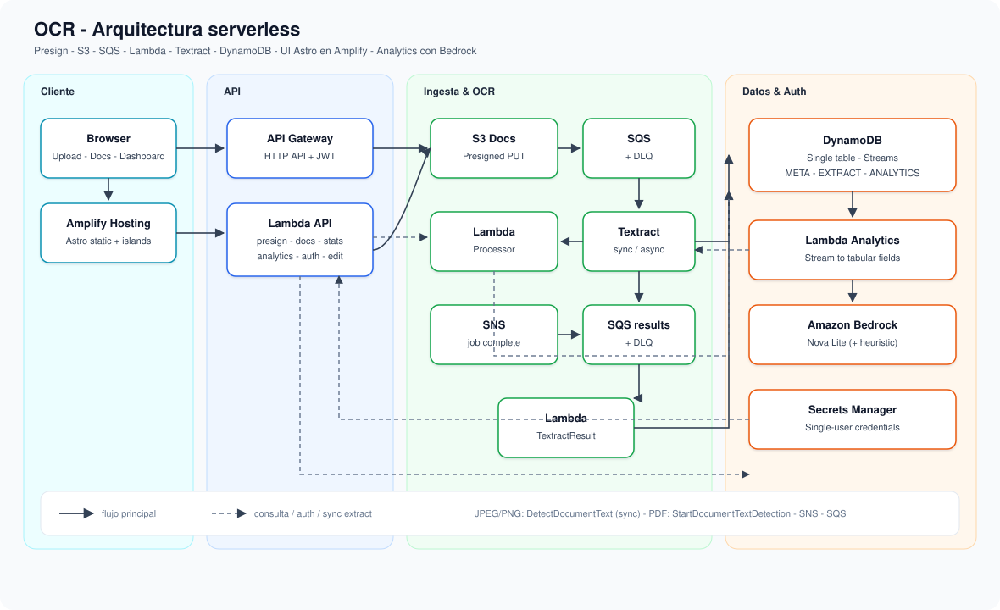

# OCR

Aplicación **full serverless** y **proyecto de aprendizaje** para subir imágenes/PDFs, extraer texto con Amazon Textract, tabular respuestas (p. ej. encuestas KAP) y explorarlas en un dashboard — desplegable en **tu propia cuenta AWS**.

```txt
Astro (Amplify) → API Gateway → Lambda API
S3 → SQS → Lambda Processor → Textract → DynamoDB
PDF async: Textract → SNS → SQS → Lambda TextractResult
EXTRACT stream → Analytics (Bedrock / heurística) → Dashboard + export PDF
```

**Principio:** la UI sube y consulta; el OCR **nunca** corre en el request path del usuario.

## Arquitectura



1. **Cliente** — Astro estático en Amplify (upload, documentos, dashboard, login).
2. **API** — HTTP API + Lambda (presign, listado, detalle, analytics, auth, corrección de campos).
3. **Ingesta & OCR** — S3 (PUT firmado) → SQS (+ DLQ) → Processor → Textract; PDFs cierran por SNS → SQS → TextractResult.
4. **Datos & auth** — DynamoDB single table (+ Streams), Bedrock Nova Lite para tabular, Secrets Manager para un usuario de demo.

## Qué incluye

| Capacidad | Detalle |
|-----------|---------|
| Bulk upload | Presign + PUT directo a S3 (sin proxyar bytes por API Gateway) |
| OCR imágenes | JPEG/PNG · `DetectDocumentText` (sync) |
| OCR PDF | Multipágina · `StartDocumentTextDetection` (async) |
| Persistencia | DynamoDB single table (`META`, `EXTRACT`, `ANALYTICS`, índices `FIELD#`, `TEXTRACT#…/LINK`) |
| Analytics | Stream sobre `EXTRACT` → Bedrock (fallback heurístico) |
| Corrección | Editar campos tabulados por documento (`PUT …/analytics/fields`) |
| Dashboard | Filtros, gráfica por pregunta, export PDF |
| Auth demo | Usuario único + JWT Bearer (Secrets Manager) |

## Stack

| Capa | Tech |
|------|------|
| Frontend | Astro (`output: 'static'`) + TypeScript · **AWS Amplify Hosting** |
| API / workers | AWS Lambda **Node.js 24** + TypeScript |
| Infra | AWS CDK (TypeScript) |
| Datos / AI | DynamoDB, S3, SQS, SNS, Textract, Bedrock, Secrets Manager |

## Estructura del monorepo

```txt
apps/web         Astro UI (upload, docs, dashboard, login)
apps/api         Lambda HTTP API
apps/processor   Workers OCR + analytics stream + textractResult
packages/shared  Tipos + esquema encuesta KAP
infra            CDK stack
docs/            Diagramas (architecture.svg)
amplify.yml      Build spec Amplify (CI desde GitHub)
scripts/         deploy-amplify.sh, backfill-analytics.ts
```

Código de aplicación en **camelCase**, Clean Code y SOLID (handlers thin + ports/adapters).

## Prerrequisitos

- Node.js 20+ (recomendado 22/24)
- AWS CLI configurado con una cuenta y región (p. ej. `us-east-1`)
- Permisos para crear Lambda, API Gateway, S3, SQS, SNS, DynamoDB, Amplify, Secrets Manager, IAM, Textract y Bedrock
- AWS CDK (`npx cdk` del workspace alcanza)
- Cuenta bootstrapeada: `cd infra && npx cdk bootstrap`
- `zip` en PATH (para `npm run deploy:web`)

> **Bedrock:** habilita el modelo `amazon.nova-lite-v1:0` (o el que configures) en la consola de Bedrock de tu cuenta/región. Sin acceso al modelo, el analytics cae al parser heurístico.

## Setup

```bash
git clone <URL-de-este-repo>
cd ocr
npm install
npm run build -w @ocr/shared
```

## Deploy infra

```bash
cd infra
npx cdk deploy
```

Anota los outputs de CloudFormation (o del final del deploy), en especial:

- `ApiUrl`
- `AmplifyAppId` / `AmplifyUrl`
- `AuthSecretArn`
- `AuthUsername`
- `TableName`

### Auth (usuario único de demo)

La API exige `Authorization: Bearer <jwt>` excepto `GET /health` y `POST /auth/login`.

Credenciales en **Secrets Manager** (`{ "username", "password", "jwtSecret?" }`):

- Por defecto el username es `admin`.
- Si no pasas password, CDK **genera** una al crear el secret.

```bash
# Definir usuario y password al desplegar (recomendado)
cd infra
npx cdk deploy -c authUsername=admin -c authPassword='elige-una-password-segura'

# Consultar el secret generado / actual (no lo compartas ni lo commits)
aws secretsmanager get-secret-value \
  --secret-id "$(aws cloudformation describe-stacks --stack-name OcrStack --query "Stacks[0].Outputs[?OutputKey=='AuthSecretArn'].OutputValue" --output text)" \
  --query SecretString --output text
```

Login: `POST /auth/login` con `{ "username", "password" }` → `{ token, username, expiresAt }`. El frontend guarda el token en `sessionStorage`.

> Esto es un **cerrojo de demo**, no un IdP. Para multi-usuario real → Cognito (roadmap).

### Conectar GitHub (CI Amplify, opcional)

1. Guarda un GitHub PAT (`repo` scope) en Secrets Manager.
2. Redesplega con tu owner/repo y el nombre del secret:

```bash
cd infra
npx cdk deploy \
  -c githubOwner=TU_USUARIO_GITHUB \
  -c githubRepo=ocr \
  -c githubTokenSecretName=NOMBRE_DE_TU_SECRET
```

## Deploy frontend

```bash
# Desde la raíz del monorepo, con el stack ya desplegado
npm run deploy:web
```

El script resuelve `ApiUrl` + `AmplifyAppId` del stack `OcrStack`, buildea Astro con `PUBLIC_API_BASE_URL` y sube el artefacto a Amplify. La URL de la app sale en el output `AmplifyUrl`.

## Web local

```bash
# apps/web/.env — usa el ApiUrl de TU deploy
PUBLIC_API_BASE_URL=https://xxxxxxxx.execute-api.region.amazonaws.com

npm run dev:web
```

Abre http://localhost:4321

## Destroy

```bash
cd infra
npx cdk destroy
```

## API

| Method | Path | Auth |
|--------|------|------|
| `GET` | `/health` | público |
| `POST` | `/auth/login` | público |
| `GET` | `/auth/me` | Bearer |
| `POST` | `/uploads/presign` | Bearer |
| `GET` | `/documents` | Bearer |
| `GET` | `/documents/{id}` | Bearer |
| `GET` | `/documents/{id}/preview-url` | Bearer |
| `PUT` | `/documents/{id}/analytics/fields` | Bearer |
| `GET` | `/stats/summary` | Bearer |
| `GET` | `/analytics/summary` | Bearer |
| `GET` | `/analytics/documents` | Bearer |

## Formatos soportados

| Content-type | Tamaño máx. | Modo Textract |
|--------------|-------------|---------------|
| `image/jpeg` | 10 MB | `DetectDocumentText` (sync) |
| `image/png` | 10 MB | `DetectDocumentText` (sync) |
| `application/pdf` | 50 MB | `StartDocumentTextDetection` (async) |

**WebP no** está soportado por Textract (se rechaza en UI y presign).

Un PDF queda en `PROCESSING` hasta la notificación del job; pasa a `COMPLETED` cuando `textractResult` persiste el extract.

## Subida de lotes

- Presign + PUT **por archivo** (no un solo presign del lote).
- Reintentos del PUT (3×) y concurrencia 2 con PDFs pesados.
- META `UPLOADED` con TTL 24 h (huérfanos sin PUT se limpian solos).

## Analytics

Al insertar `EXTRACT`, DynamoDB Streams dispara `analyticsStream`:

1. Tabula con **Bedrock** (`amazon.nova-lite-v1:0`) o fallback heurístico.
2. Escribe `DOC#…/ANALYTICS` + `FIELD#…` / rollups.
3. Alimenta dashboard, filtros y export PDF.

Backfill (en tu cuenta, con el `TableName` de tu stack):

```bash
TABLE_NAME=$(aws cloudformation describe-stacks --stack-name OcrStack --query "Stacks[0].Outputs[?OutputKey=='TableName'].OutputValue" --output text)
TABLE_NAME=$TABLE_NAME FORCE=1 npx tsx scripts/backfill-analytics.ts
```

## Guía rápida (clone → deploy → demo)

1. `npm install` y `cd infra && npx cdk bootstrap && npx cdk deploy` (define auth con `-c`).
2. Anota `ApiUrl` / `AmplifyUrl` / `AuthSecretArn`.
3. `npm run deploy:web` desde la raíz.
4. Abre `AmplifyUrl`, inicia sesión con el usuario/password de tu secret.
5. Sube un PNG y un PDF pequeño; espera `COMPLETED`.
6. Corrige un campo en el detalle; prueba filtros y **Exportar PDF** en el dashboard.
7. `npx cdk destroy` cuando termines (cuenta de laboratorio).

## Licencia

MIT. Ver [`LICENSE`](LICENSE).
